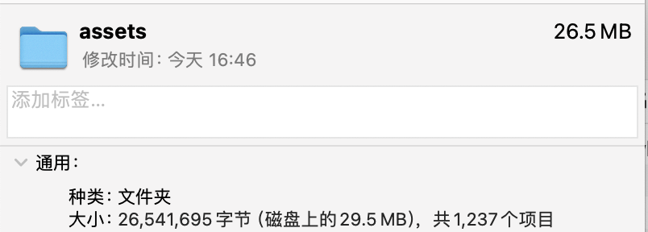
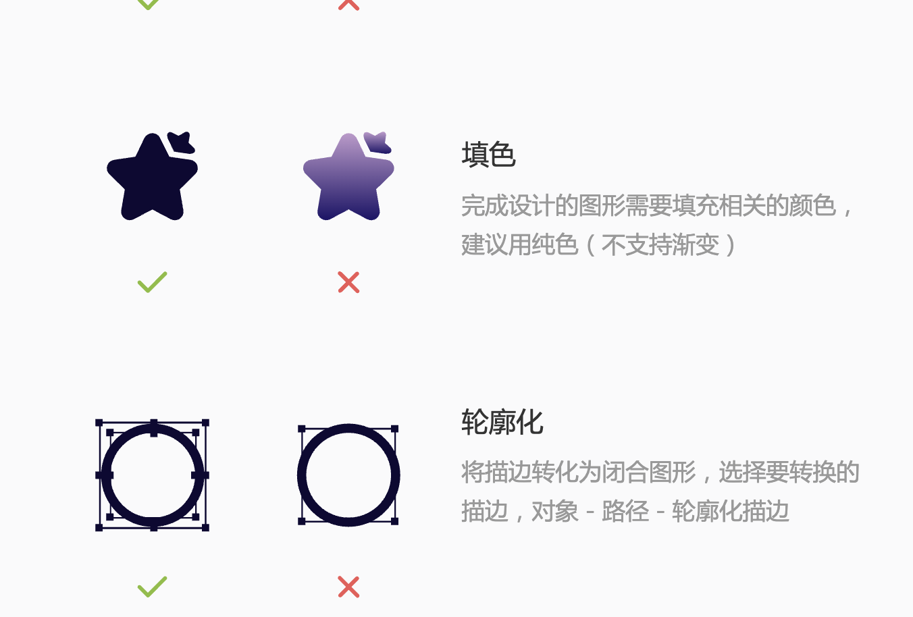

## 前言

> 
> 12345
>


我想给公司的项目做icon图标管理的念头是从去年年底给公司官网主项目搭建移动web端就开始了的，在2023年11月左右，我试图将公司主项目的图标转移到阿里巴巴的iconfont平台上去托管和使用，但是实操下来效果并不如人意，且实际项目痛点并没有很好的解决。最近公司要起一个新的聊天机器人的项目，于是又开始在一堆图标管理方案中转来转去最后选择了现在的iconify作为最终选择。本文是我在进行选型的时候的一些思考的记录

## 没有图标管理

### 情况说明

公司早期的图标资源全都是在蓝湖上由设计使用sketch切图切出来的2倍png图标。在项目中则是按功能模块进行的资源管理。去年年中开始做的官网主项目延用了这个习惯，按页面路由-页面功能模块来存储icons，到今天的整个资源目录长这样（目录树太长了就不输出了。看个大小吧）



assets里包含了icons、images、lotties、mp4等一切资源内容。而所占内容最多的还是icon图标

在没有图标管理方案的情况下，每一次的需求开发，都是由设计切图，然后研发下载图片资源，不同模块间的资源几乎没有复用，不仅是研发侧没复用，而是设计侧也鲜有资源的复用。于是在半年的高强度需求开发下，资源目录和大小变成了如今这个样子。

### 痛点分析

在没有图标管理方案的场景下，主要有以下几个方面的痛点：

1. 资源复用率低，页面内资源会重复加载，弱网情况下（服务器在美东，用户有欧洲的有南亚的也有非洲的）用户体验将会非常差，页面闪烁严重。

2. 资源灵活度低，很多时候只是需要一个改色的icon。本身svg就能实现的事情却要分情况导入两个icon。

3. 在某些svg内包含大量text的情况，如果导出png，有概率会导致图片失真，而以svg+text标签的方式导入存在字体资源的问题，而栅个化为path，svg的体积又会变的很大。比如下图的场景。

   

## 第一版本的解决方案：iconfont

### 情况说明

实际上第一版本的解决方案最初是某一个设计人员给我提的，某天我和设计人员聊图标库和图标复用的事情，对方提到了阿里的iconfont平台。我说行，于是后面就开始着手做这事儿了。

选择iconfont的理由，主要是为了解决上面提到的痛点中的第一、第二项痛点。iconfont支持以font-class或者symbol的方式引用。font-class+font-color的方式解决了变色图标重复引入的问题，而symbol的方式也可以支持引入多色图标。

我在iconfont的基础上，封装出了支持symbol和font-class两种使用方式的icon组件。期望可以有效解决资源复用的问题。确确实实，在后续的开发中。图标资源的复用率得到了有效提升，但是iconfont的使用又带来了额外的痛点。

### 痛点分析

iconfont是一个很不错的图标方案，但是基于阿里巴巴的iconfont平台进行图标管理，以下几个问题。

#### icon库和设计侧仍然存在隔阂

简单来说就是，iconfont是面向研发侧的，而非设计侧，iconfont的图标库是需要设计侧在设计软件（比如figma）上单独维护一个图标库，然后将图标库发布到iconfont的项目中，最后在由研发同步代码。这样做在我公司最大的问题是，设计和前端研发常常是两条有时间差的并行线，而非一条串行线，忙于改图的设计根本没有时间将新增的图标做整理并发布到iconfont平台，于是iconfont的发布是由研发侧来维护的，反而增加了研发侧的工作量，有点丢了西瓜捡了芝麻的感觉。

另外，iconfont对设计侧有额外的要求。首先第一点。iconfont上可使用的图标需要遵循他的设计规范，拿最头疼的一点来说。就是iconfont上传图标的时候，要求图标是轮廓化的，非渐变色的图标，且需要进行轮廓化。这就导致带渐变色的图标就需要单独进行维护，且figma上，使用stroke绘制的图标在轮廓化的时候会出现额外的颜色填充类的问题，需要花费额外的心智去处理。


此外，iconfont的设计规范要求上传图标的时候尽可能撑满整个区域，而这一点没有对设计侧进行强规范，常常出现的情况是设计侧的设计图icon周围留白未统一，研发虽然使用了同一个icon。但是无法直接使用设计图的上的icon尺寸导致最终效果出现误差。

总结一下，**设计图和iconfont不在同一层上**。设计人员和iconfont的关系是：**设计-->iconfont-->研发**（设计维护图标库，而设计图的设计并不依赖于图标库），而非iconfont-->设计-->研发。

#### iconfont是半自动化的

这很关键，也很风险。
```tsx
const A = <div>123</div>
```

#### iconfont没有懒加载

iconfont是全量引入而非懒加载。特别是即使用font-class又实用iconset的时候，资源大小实际是两倍大、造成了额外的包体积。

## 最终方案：iconify

我了解到iconify是在学习unocss的时候知道了有这么个工具，而决定让我引入这个方案的原因则是他支持直接从figma上导入图标。

具体方案可以看官方文档[Importing icons from Figma](https://iconify.design/docs/libraries/tools/import/figma/)

以下是我认为的iconify的一些优点。

### 设计侧心智负担小

我们可以对比一下iconfont和iconify在设计层的区别。

如果想要很好的使用iconfont。首先设计侧需要了解iconfont的图标设计规范，然后按规范设计图标，维护自定义图标库，然后将图标上传到iconfont。

如果使用了iconify。那设计侧只需要负责设计图标，并且维护自定义图标库就可以了。省去了学习iconfont设计规范的心智负担。

### 导入、导出极其灵活

iconify支持从svg导入为iconify的IconSet类型，也支持从IconSet中的数据生成svg。因此我可以从figma生成对应的IconSet，然后根据实际需求决定是使用svg还是使用IconSet的Json文件（用以接入iconify的插件）。[IconSet Class](https://iconify.design/docs/libraries/tools/icon-set/#iconset-class)

### 几乎全自动、支持svg优化

在iconify的帮助下，前端研发和UI设计是直接打通了的，并不需要使用第三方平台来作为中转（比如iconfont）设计侧更新了图标，那研发侧需要做的仅仅是跑一下node脚本。

并且iconify提供了runSVGO和cleanUp方法，可以对svg进行优化，无需在webpack中配置额外的svgo操作。[Icon Manipulation](https://iconify.design/docs/libraries/tools/icon/)

### tailwind友好，零运行时负担

iconify本身就有tailwind、unocss等方案的插件，同样也支持导入自定义iconSet的json文件，能吃到tailwind的懒加载和treeshaking，都是编译时的内容，无运行时负担。

## 总结

目前iconify是我找到的最适合我公司的图标管理方案。他能不产生副作用的情况下解决文章开头提到的第一、第二项痛点。如果后续的使用发现了新的痛点或者副作用，我会再做分享。至于第三项痛点，私以为最优解其实时封装组件，使用inline-svg。这种方案也不属于图标管理的一部分了。后面要是也能找到解决第三项痛点的方案，我也会再做分享。

如果你的情况和我一样，受困与图标管理方案而没有什么头绪，那么不妨考虑一下iconify。
